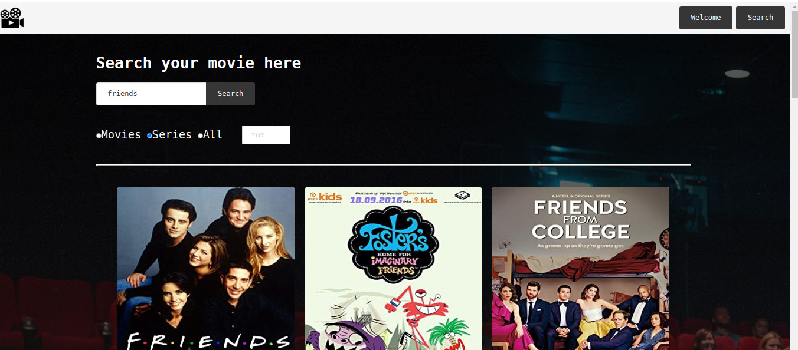

###  General Assembly, Software Engineering Immersive

# Movie Search 🎬 

## Overview
For my second General Assembly project we paired up and were tasked to create a multi-page app using an API of our choosing within 48 hours. 

## Brief 

* **Consume a public API** – this could be anything but it must make sense for your project.
* Have several components
* **The app should include a router** - with several "pages".
* Have **semantically clean HTML** - you make sure you write HTML that makes structural sense rather than thinking about how it might look, which is the job of CSS.
* Deploy it online so it's publicly accessible

# Technologies Used
 - React.js
 - GitHub
 - Babel
 - Webpack
 - Bulma
 - Insomnia
 - OMDB API

## Approach Taken 
The first step for this paired project was to decide on a theme for our app and the best API to use to bring our vision to life. 
We wanted to create an app that would search for movies and TV programmes not only by name, but with additional filters by type and/or year. We would display the results on the page, each card being a link to more information on the movie.
Whiteboarding out the basic structure along with the functions and components.
Next we created the basic React structure and built the logic to our main component the `search`. 

## Challenges 
 - Make the search filters work nicely together
 - Adding pagination
   - Might be a large number of results for a single query
   - The API has a limit of 10 results per page. 

**Search**

In order to store the relevant property values in the Search component, we used the `useState` React hook. 
We used `axios` to fetch the data from the API

1. To search for a key word, we got the input value from the search bar as a variable `{searched}`. This was then added to the URL to create the `plainUrl` variable
2. To add a variety of filters onto our search function we used radio buttons - movies, series, all - and also filtering by year. 
3. To achieve the filter as per the users request, we needed to implement an `if-else` statement to ensure that the function ran, no matter how many filters were being used at once. 
4. We used the `useEffect` react hook to make the fetch only when needed - such as when a new filter or search was created. 

```javaScript
const searchFunction = (searched, category, year, page) => {
    const plainUrl = `https://www.omdbapi.com/?apikey=${process.env.API_KEY}&s=${searched}&page=${page}`
    const urlCategory = `${plainUrl}&type=${category}`
    const urlYear = `${plainUrl}&y=${year}`
    const urlLong = `${urlCategory}&y=${year}`
    let url = ''

    if (year && !category) {
      url = urlYear
    } else if (category && !year) {
      url = urlCategory
    } else if (year && category) {¢
      url = urlLong
    } else {
      url = plainUrl
    }
    if (searched) {
      axios.get(url)
        .then(resp => {
          updateDisplaySearch(resp.data.Search || [])
          updateError(resp.data.Error || '')
          updateNumResults(resp.data.totalResults)
        })
    }
  }
  useEffect(() => {
    return searchFunction(searched, category, year, page)
  }, [searched, category, year, page])
  ```

Working example of the search function: 


 
 


  **Pagination**

  We imported the `Pagination` package component
  To crack the API limit 10/page we used the the total results to work out the total number of pages in the pagination component.

```
 const Pager = ({ currentPage }) => {
    const pages = Math.ceil(numResults / POSTS_PER_PAGE)
    return (
      <Pagination
        pages={pages}
        currentPage={currentPage}
        onChange={page => updatePage(page)}
      />
    )
  }
```
After refactoring our plain URL to include the page number, we were able to implement the pagination to track the current page and to update. 

To make this component work within the boundaries of this API was a challenge, however we managed to get it working well. 


## Movie Page

 We used props to pull through the movie ID needed that would render the specific information for that film/programme onto the single movie page.
 We used react-router to link pages throughout our app.

``` const Movie = (props) => {
  const movieId = props.match.params.movieId
  const [movie, updateMovie] = useState([])
  { console.log(movieId) }

  useEffect(() => {
    axios.get(`https://www.omdbapi.com/?apikey=${process.env.API_KEY}&i=${movieId}`)
      .then(resp => {
        updateMovie(resp.data)
      })
  }, []) 
  
  ```
  


# Future enhancements.
 - We think this project would benefit from a moving carousel on the search page which could display featured movies theat the user could explore.

- create a wish list. 

- With more time we would have like to have combined another API to provide more information 

## Summary

Over the course of this hackathon, we became more comfortable with a variety of technical skills such as using APIs and pagination. 
We can now confidently read the documentation and collect  the information from a public API.
We solidified the knowledge to transfer information between components and make `fetch` requests to specific URLs by utilising `template literals`. 

Lessons Learned:
  - efficient ways to pair-programming
  - meeting strict deadlines 
  - develop a presentation skills through the demo proccess
